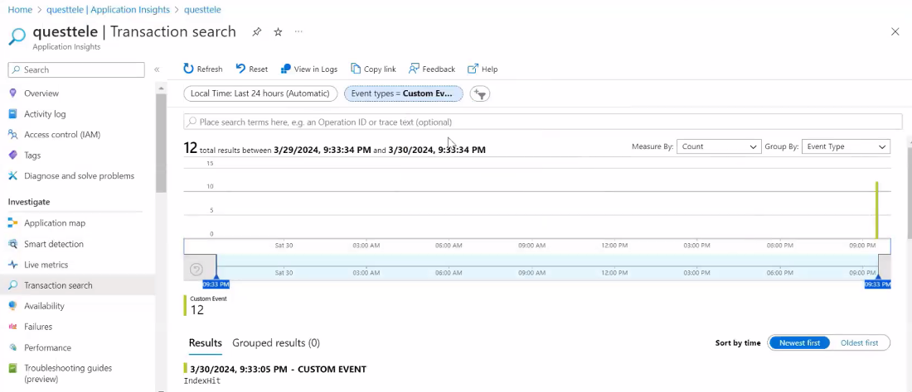

# Azure Training
Notes for Azure Training and Code Snippets

Cloud = PAY AS YOU Go
- Concepts of IAAS, PAAS, SAAS 
- Cloud is more OPEX rather than CAPEX. 
- Data Centers in Azure are structured as Geography, Region, Zones and Availability Zone 

## Availability Zone
- An Availability Zone, on the other hand, is a physically separate data center within an Azure region. 
- Each Availability Zone has its own power, cooling, and networking infrastructure2. 
- By deploying your VMs across multiple Availability Zones, you can protect your applications from datacenter failures. 
- This setup provides even higher reliability and an SLA of 99.99%

## Availability Set 
- An Availability Set is a logical grouping of two or more virtual machines (VMs) that helps keep your applications available during hardware or software failures. 
- By placing VMs in different fault domains and update domains, Availability Sets reduce the chance of correlated failures affecting all VMs at the same time. 
- This setup helps meet the 99.95% Azure service-level agreement (SLA)
-

## Fault Domain 
- A fault domain is a group of Azure resources that share a common power source and network switch. 
- When you create VMs within an Availability Set, Azure automatically distributes them across different fault domains. This helps minimize the risk of a single point of failure (like a power outage or network switch failure) affecting all your VMs in an Availability Set. 
- Typically, Azure offers up to three fault domains per region.

## Update Domain 
- An update domain is a logical group of VMs that can be updated and rebooted together. 
- Azure divides the VMs in an Availability Set into multiple update domains to ensure that not all VMs are rebooted at the same time when maintenance or updates are applied. 
- This helps maintain the availability of your applications during planned updates. 
- Azure usually offers up to 20 update domains per region.

### By combining fault domains and update domains, Azure enhances the reliability and availability of your applications, providing resilience against both hardware failures and planned maintenance events.

## Virtual Machine Scale Sets(VMSS)
- A Virtual Machine Scale Set allows you to create and manage a group of identical, load-balanced VMs. 
- VMSS is designed to automatically increase or decrease the number of VMs in response to demand, ensuring your application can scale efficiently.

## Scaling and Slots in Azure App Services
- 
- In case of Scale Out, we add new instances. We can scale out manually or auto-scaling based on certain number of requests/second
- 
- 
- We can swap slots(development to production and vice versa)


## Telemetry
- 
- Telemetry means we need to send small sets of information to the log. What is the RAM consumed at what time. 
- For telemetry we need to put code inside our application called instrumentation.
- Tracing is tracking the user flow 
- All the information is sent and saved inside Application Insights. 
- We can add a nuget package called Microsoft.ApplicationInsights.AspNetCore
- We need to add services.AddApplicationTelemetry() in Program.cs file. 
- 
- We use Telemetry Client object 
- 
- 
- We can write KQL queries to get the logs inside application insights. 
- Rather than using TelemetryClient we can use OpenTelemetry 
- Open Telemetry not only works with Application Insights, it also works with other Telemetry Databases. 

## Function Apps and Logic Apps
- In Function Apps, we also have durable function apps. 
- 
- In Durable Function apps, we have an orchestrator and the child tasks functions
- 
- Logic Apps are more about workflows. 

## Azure Data Storages
- 4-5 kinds of Azure Data Storages
- We have Azure Sql Server(CPU based billing or DTU based billing)
- We also have Elastic DTUs 
- We have Blobs, Queues, tables and Files. 
- In case of Blobs we can stream 
- We have Page Blob, Append Blob. 
- 
- We also have Azure Data Tables. 

## Azure Security (Azure AD)
- OIDC is for both authentication and authorization. 
- We have Authorization Code Flow. 
- In case of implicit flow, there is no code generated. 
- We have hybrid flow and client credential flow also. 


## Azure ML
- In Azure ML, we have Azure Machine Learning Studio. 
- We have supervised and unsupervised learning. 
- 
- We can query the Model. 


## Azure Devops 
- We have Azure Pipelines. 
- We created an agent 
- We can take an ASP.NET Core application and make it live in IIS. 

## APIM
- API is a gateway service. 
- Azure API Management (APIM) is a fully managed service that enables you to publish, secure, and scale APIs. It acts as a gateway between your API consumers and your backend services, providing a range of features to manage and monitor APIs effectively
- API Gateway: Acts as the endpoint for API requests, routing them to the appropriate backend services. It also handles security, throttling, caching, and observability
- 
- We can define policies using inbound and outbound XML. 

## Azure Data Factory
- It is an ETL tool.


## Azure Load Balancers, Application Gateway and Azure Networking
- Understanding of VNET, Subnet, NSG groups. 
- We also have Load Balancers. 
- In Networking Layer we have Azure Load Balancer.
- In the Application Layer we have Azure Front Door Service and Azure Application Gateway. 
- 
- We also have Web Application Firewall. 

## Automation in Azure.
- Using ARM templates and Azure Automate.
- Powershell.

## Azure Messaging
- Azure Storage Queues, events and Azure Service Bus. 


## Azure Service Bus 
- 
- Azure Service Bus is a fully managed enterprise message broker service offered by Microsoft Azure. 
- It provides reliable and secure asynchronous messaging between various applications and services. 
- Here are the key aspects of Azure Service Bus
### Message Queues:
- Queues: Store messages until the receiving application is available to process them. Each message is processed by a single consumer.
- FIFO: Messages are typically processed in the order they were added to the queue (First In, First Out).
### Topics and Subscriptions:
- Topics: Allow for one-to-many communication. A message sent to a topic can be received by multiple subscribers.
- Subscriptions: Each subscription to a topic will receive a copy of each message sent to that topic. Filters can be applied to subscriptions to receive only certain messages.
### Message Sessions:
- Sessions: Enable ordered handling of unbounded sequences of related messages. This is particularly useful for workflows that require message ordering.
### Message Reliability:
- Durable Messaging: Messages are stored reliably in the Service Bus until they are consumed.
- Dead-Letter Queues (DLQ): Messages that cannot be delivered or processed can be moved to a dead-letter queue for further investigation.
### Scheduled Messages: Messages can be scheduled to be sent at a specific time.
### Batching and Transactions: Supports sending and receiving multiple messages in a single transaction.
### Topic Namespace
- Definition: A namespace in Azure Service Bus is a container for all messaging components, such as queues, topics, and subscriptions.
- Purpose: It provides a scoping container for addressing, management, and grouping of messaging entities.
- Functionality: Within a single namespace, you can have multiple topics and queues. It helps organize and manage resources effectively.
- Example: Think of a namespace as a building that contains various rooms (topics and queues). The building organizes these rooms under one address.
### Topics
- Definition: Topics are used for one-to-many communication. They allow messages to be sent to multiple subscribers.
- Purpose: To enable multiple consumers to receive the same message or a filtered subset of messages.
- Functionality: When a message is sent to a topic, it is copied to each subscription associated with that topic. Topics support publish-subscribe scenarios.
- Example: Imagine a radio station (topic) broadcasting signals (messages). Different radios (subscriptions) tuned to that station will receive the broadcast.
### Subscriptions
- Definition: Subscriptions are receivers of messages from a topic. Each subscription gets a copy of the message sent to the topic.
- Purpose: To receive and process messages published to a topic. Subscriptions can also filter messages to receive only those that meet certain criteria.
- Functionality: Subscriptions can have rules and filters to specify which messages they want to receive from the topic. Each subscription is like an individual queue that stores messages until the subscriber retrieves them.
- Example: Continuing the radio analogy, a subscription is like a specific radio receiver. It can be tuned to specific frequencies (filters) to receive only certain broadcasts.
- 
- 
- 
- 
- In Azure Service Bus, you have two common methods for receiving messages: peek and read-delete. Each method serves different purposes and has its own use cases. Here's a breakdown of when to use each method:

- Peek
- Definition: The peek operation reads a message from the queue or topic subscription without removing it from the queue.
- Use Case: Useful when you want to inspect messages without consuming them. It's often used for debugging, monitoring, or auditing purposes.
- Advantage: Messages remain in the queue, so they can be processed later by the same or different consumers.
- Example Scenario: You have a monitoring tool that checks the status of messages in the queue without affecting the message processing workflow.

- Read-Delete
- Definition: The read-delete operation (also known as "receive and delete") reads a message and removes it from the queue in a single operation.
- Use Case: Suitable when message processing is guaranteed to succeed, and you don't need to reprocess messages.
- Reliability:
- Peek: Provides higher reliability since messages are not removed until explicitly processed. This allows for retries in case of failures.
- Read-Delete: Less reliable in scenarios where message processing might fail, as the message is removed immediately and cannot be retried.
- Use peek when you need to inspect messages without consuming them, or when you require high reliability and want to handle message retries.
- Use read-delete when you have a simple, reliable processing system and want to immediately remove messages after reading them.
### Securing messages and ensuring proper authentication when implementing the receive from topics in Azure Service Bus is critical for maintaining the integrity and confidentiality of your data. Here are the key steps to achieve this:

- Step 1: Use Shared Access Signatures (SAS)
Create a SAS Token: Generate a Shared Access Signature (SAS) token for your Service Bus topic.
```shell
 az servicebus topic authorization-rule keys list --resource-group <resource-group> --namespace-name <namespace> --topic-name <topic-name> --name <authorization-rule-name>

# Use the SAS Token: Use the SAS token to authenticate when receiving messages.
 string connectionString = "Endpoint=sb://<namespace>.servicebus.windows.net/;SharedAccessKeyName=<key-name>;SharedAccessKey=<key-value>";


```
- Step 2: Use Managed Identities
- Enable Managed Identity: Enable Managed Identity for your application (e.g., Azure Function, VM).
```shell
 az identity create --resource-group <resource-group> --name <identity-name>

```
- Grant Access: Assign the managed identity access to your Service Bus.
```shell
 az role assignment create --assignee <managed-identity-id> --role "Azure Service Bus Data Receiver" --scope <service-bus-scope>


```
- Authenticate with Managed Identity: Use the Managed Identity to authenticate when receiving messages.
```shell
 var tokenProvider = TokenProvider.CreateManagedIdentityTokenProvider();
var client = new QueueClient(new Uri("sb://<namespace>.servicebus.windows.net/"), "queue-name", tokenProvider);

```
- Enforce TLS: Ensure that all connections to the Service Bus use TLS to encrypt data in transit.
- This is typically enforced by default in Azure Service Bus.
- Azure Active Directory (AAD): Integrate AAD for robust authentication and access control.

## Partition support in Azure Service Bus queues and topics allows you to scale your messaging entities by distributing them across multiple message brokers and messaging stores

### What is Partitioning?
- Partitioning means that a queue or topic is divided into multiple partitions, each managed by a different message broker and stored in a different messaging store. This setup increases the overall throughput and availability of the messaging entity
### Benefits of Partitioning
- Scalability: By distributing the load across multiple partitions, you can handle higher message throughput.
- High Availability: If one partition or message broker goes down, the other partitions remain available, ensuring continuous message processing.
- Improved Performance: Multiple partitions can handle more messages simultaneously, reducing bottlenecks

## Implementing it in C# code
- 
- Add dotnet package:
```shell
dotnet add package Azure.Messaging.ServiceBus

```
- Configure Azure Service bus connection in appsettings.json 
```json
 {
  "ServiceBus": {
    "ConnectionString": "YourServiceBusConnectionString",
    "TopicName": "YourTopicName",
    "SubscriptionName": "YourSubscriptionName"
  }
}


```

- Create the Publisher in the Web API
```c#
 using Azure.Messaging.ServiceBus;
using Microsoft.AspNetCore.Mvc;
using Microsoft.Extensions.Configuration;
using System.Threading.Tasks;

[Route("api/[controller]")]
[ApiController]
public class PublishController : ControllerBase
{
    private readonly ServiceBusClient _client;
    private readonly string _topicName;

    public PublishController(IConfiguration configuration)
    {
        var connectionString = configuration["ServiceBus:ConnectionString"];
        _topicName = configuration["ServiceBus:TopicName"];
        _client = new ServiceBusClient(connectionString);
    }

    [HttpPost]
    public async Task<IActionResult> PublishMessage([FromBody] string message)
    {
        ServiceBusSender sender = _client.CreateSender(_topicName);
        ServiceBusMessage serviceBusMessage = new ServiceBusMessage(message);

        await sender.SendMessageAsync(serviceBusMessage);
        return Ok("Message published successfully.");
    }
}


```
- Create the Subscriber in the Web API
- Create a background service to subscribe to the Azure Service Bus topic.
```c#
 using Azure.Messaging.ServiceBus;
using Microsoft.Extensions.Configuration;
using Microsoft.Extensions.Hosting;
using Microsoft.Extensions.Logging;
using System;
using System.Threading;
using System.Threading.Tasks;

public class ServiceBusSubscriber : BackgroundService
{
    private readonly ServiceBusClient _client;
    private readonly ServiceBusProcessor _processor;
    private readonly ILogger<ServiceBusSubscriber> _logger;

    public ServiceBusSubscriber(IConfiguration configuration, ILogger<ServiceBusSubscriber> logger)
    {
        var connectionString = configuration["ServiceBus:ConnectionString"];
        var topicName = configuration["ServiceBus:TopicName"];
        var subscriptionName = configuration["ServiceBus:SubscriptionName"];

        _client = new ServiceBusClient(connectionString);
        _processor = _client.CreateProcessor(topicName, subscriptionName, new ServiceBusProcessorOptions());
        _logger = logger;
    }

    protected override async Task ExecuteAsync(CancellationToken stoppingToken)
    {
        _processor.ProcessMessageAsync += MessageHandler;
        _processor.ProcessErrorAsync += ErrorHandler;
        await _processor.StartProcessingAsync(stoppingToken);
    }

    private async Task MessageHandler(ProcessMessageEventArgs args)
    {
        string body = args.Message.Body.ToString();
        _logger.LogInformation($"Received message: {body}");
        await args.CompleteMessageAsync(args.Message);
    }

    private Task ErrorHandler(ProcessErrorEventArgs args)
    {
        _logger.LogError(args.Exception, "Message handler encountered an exception");
        return Task.CompletedTask;
    }

    public override async Task StopAsync(CancellationToken stoppingToken)
    {
        await _processor.StopProcessingAsync(stoppingToken);
        await base.StopAsync(stoppingToken);
    }
}


```
- Then we just need to register our subscriber in Program.cs file like this: 

```c#
 public void ConfigureServices(IServiceCollection services)
    {
        services.AddControllers();
        services.AddHostedService<ServiceBusSubscriber>();
    }

```