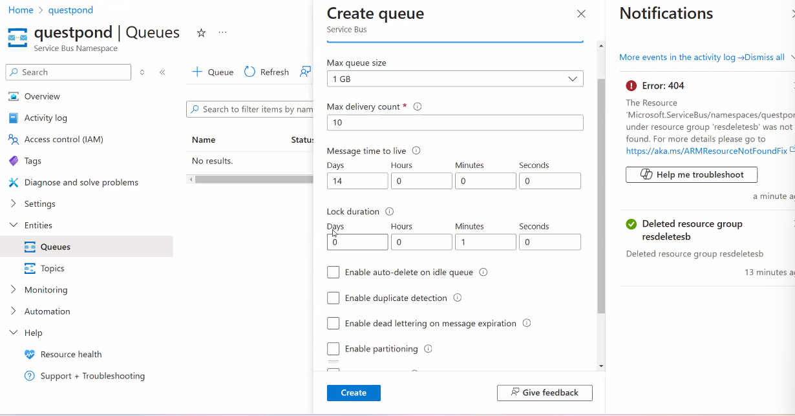
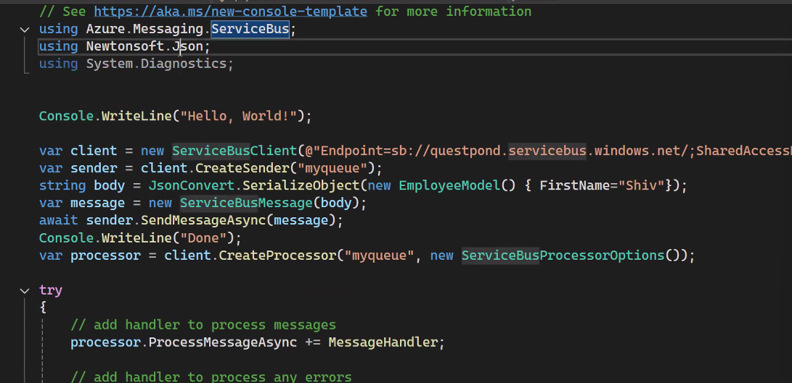
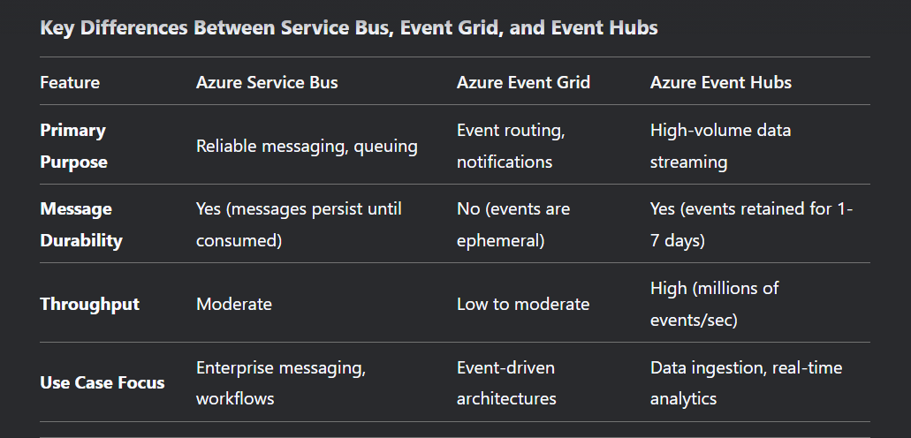
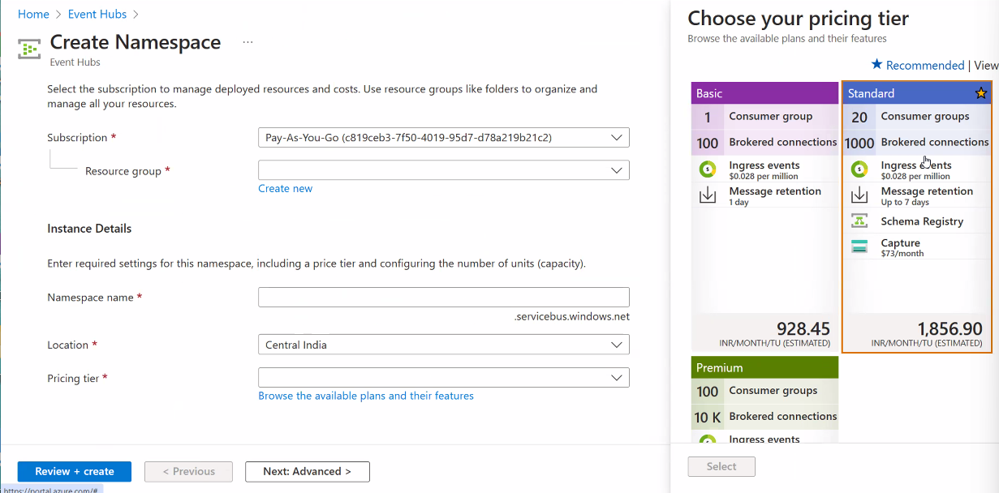
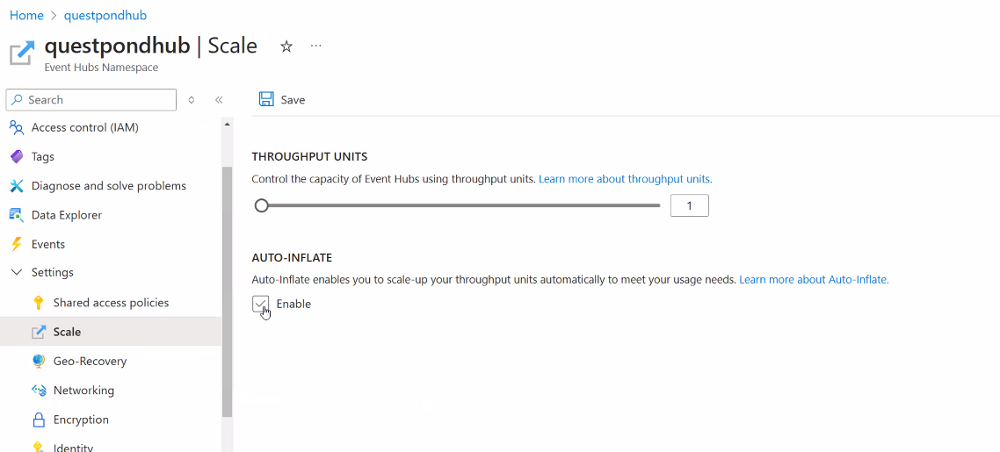
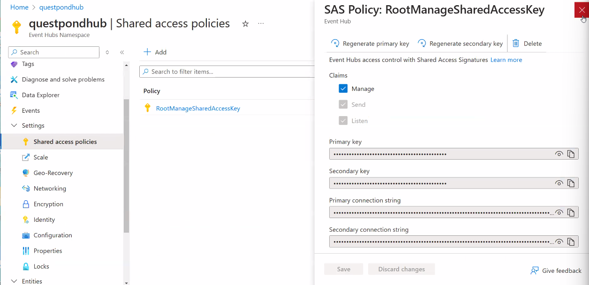
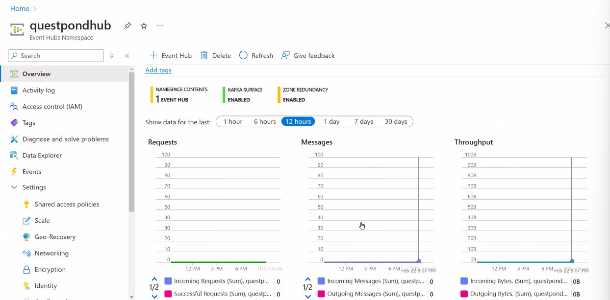
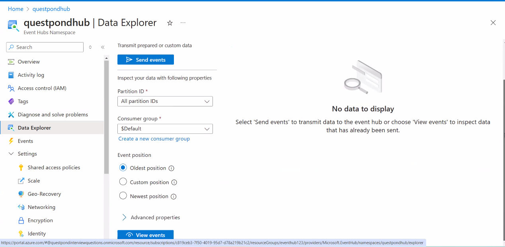

# Azure Training
Notes for Azure Training and Code Snippets

Cloud = PAY AS YOU Go
- Concepts of IAAS, PAAS, SAAS 
- Cloud is more OPEX rather than CAPEX. 
- Data Centers in Azure are structured as Geography, Region, Zones and Availability Zone 

## Availability Zone
- An Availability Zone, on the other hand, is a physically separate data center within an Azure region. 
- Each Availability Zone has its own power, cooling, and networking infrastructure2. 
- By deploying your VMs across multiple Availability Zones, you can protect your applications from datacenter failures. 
- This setup provides even higher reliability and an SLA of 99.99%

## Availability Set 
- An Availability Set is a logical grouping of two or more virtual machines (VMs) that helps keep your applications available during hardware or software failures. 
- By placing VMs in different fault domains and update domains, Availability Sets reduce the chance of correlated failures affecting all VMs at the same time. 
- This setup helps meet the 99.95% Azure service-level agreement (SLA)
-

## Fault Domain 
- A fault domain is a group of Azure resources that share a common power source and network switch. 
- When you create VMs within an Availability Set, Azure automatically distributes them across different fault domains. This helps minimize the risk of a single point of failure (like a power outage or network switch failure) affecting all your VMs in an Availability Set. 
- Typically, Azure offers up to three fault domains per region.

## Update Domain 
- An update domain is a logical group of VMs that can be updated and rebooted together. 
- Azure divides the VMs in an Availability Set into multiple update domains to ensure that not all VMs are rebooted at the same time when maintenance or updates are applied. 
- This helps maintain the availability of your applications during planned updates. 
- Azure usually offers up to 20 update domains per region.

### By combining fault domains and update domains, Azure enhances the reliability and availability of your applications, providing resilience against both hardware failures and planned maintenance events.

## Virtual Machine Scale Sets(VMSS)
- A Virtual Machine Scale Set allows you to create and manage a group of identical, load-balanced VMs. 
- VMSS is designed to automatically increase or decrease the number of VMs in response to demand, ensuring your application can scale efficiently.

## Scaling and Slots in Azure App Services
- 
- In case of Scale Out, we add new instances. We can scale out manually or auto-scaling based on certain number of requests/second
- 
- 
- We can swap slots(development to production and vice versa)


## Telemetry
- 
- Telemetry means we need to send small sets of information to the log. What is the RAM consumed at what time. 
- For telemetry we need to put code inside our application called instrumentation.
- Tracing is tracking the user flow 
- All the information is sent and saved inside Application Insights. 
- We can add a nuget package called Microsoft.ApplicationInsights.AspNetCore
- We need to add services.AddApplicationTelemetry() in Program.cs file. 
- 
- We use Telemetry Client object 
- 
- 
- We can write KQL queries to get the logs inside application insights. 
- Rather than using TelemetryClient we can use OpenTelemetry 
- Open Telemetry not only works with Application Insights, it also works with other Telemetry Databases. 

## Function Apps and Logic Apps
- In Function Apps, we also have durable function apps. 
- 
- In Durable Function apps, we have an orchestrator and the child tasks functions
- 
- Logic Apps are more about workflows. 

## Azure Data Storages
- 4-5 kinds of Azure Data Storages
- We have Azure Sql Server(CPU based billing or DTU based billing)
- We also have Elastic DTUs 
- We have Blobs, Queues, tables and Files. 
- In case of Blobs we can stream 
- We have Page Blob, Append Blob. 
- 
- We also have Azure Data Tables. 

## Azure Security (Azure AD)
- OIDC is for both authentication and authorization. 
- We have Authorization Code Flow. 
- In case of implicit flow, there is no code generated. 
- We have hybrid flow and client credential flow also. 


## Azure ML
- In Azure ML, we have Azure Machine Learning Studio. 
- We have supervised and unsupervised learning. 
- 
- We can query the Model. 


## Azure Devops 
- We have Azure Pipelines. 
- We created an agent 
- We can take an ASP.NET Core application and make it live in IIS. 

## APIM
- API is a gateway service. 
- Azure API Management (APIM) is a fully managed service that enables you to publish, secure, and scale APIs. It acts as a gateway between your API consumers and your backend services, providing a range of features to manage and monitor APIs effectively
- API Gateway: Acts as the endpoint for API requests, routing them to the appropriate backend services. It also handles security, throttling, caching, and observability
- 
- We can define policies using inbound and outbound XML. 

## Azure Data Factory
- It is an ETL tool.


## Azure Load Balancers, Application Gateway and Azure Networking
- Understanding of VNET, Subnet, NSG groups. 
- We also have Load Balancers. 
- In Networking Layer we have Azure Load Balancer.
- In the Application Layer we have Azure Front Door Service and Azure Application Gateway. 
- 
- We also have Web Application Firewall. 

## Automation in Azure.
- Using ARM templates and Azure Automate.
- Powershell.

## Azure Messaging
- Azure Storage Queues, events and Azure Service Bus. 


## Azure Service Bus 
- 
- Azure Service Bus is a fully managed enterprise message broker service offered by Microsoft Azure. 
- It provides reliable and secure asynchronous messaging between various applications and services. 
- Here are the key aspects of Azure Service Bus
### Message Queues:
- Queues: Store messages until the receiving application is available to process them. Each message is processed by a single consumer.
- FIFO: Messages are typically processed in the order they were added to the queue (First In, First Out).
### Topics and Subscriptions:
- Topics: Allow for one-to-many communication. A message sent to a topic can be received by multiple subscribers.
- Subscriptions: Each subscription to a topic will receive a copy of each message sent to that topic. Filters can be applied to subscriptions to receive only certain messages.
### Message Sessions:
- Sessions: Enable ordered handling of unbounded sequences of related messages. This is particularly useful for workflows that require message ordering.
### Message Reliability:
- Durable Messaging: Messages are stored reliably in the Service Bus until they are consumed.
- Dead-Letter Queues (DLQ): Messages that cannot be delivered or processed can be moved to a dead-letter queue for further investigation.
### Scheduled Messages: Messages can be scheduled to be sent at a specific time.
### Batching and Transactions: Supports sending and receiving multiple messages in a single transaction.
### Topic Namespace
- Definition: A namespace in Azure Service Bus is a container for all messaging components, such as queues, topics, and subscriptions.
- Purpose: It provides a scoping container for addressing, management, and grouping of messaging entities.
- Functionality: Within a single namespace, you can have multiple topics and queues. It helps organize and manage resources effectively.
- Example: Think of a namespace as a building that contains various rooms (topics and queues). The building organizes these rooms under one address.
### Topics
- Definition: Topics are used for one-to-many communication. They allow messages to be sent to multiple subscribers.
- Purpose: To enable multiple consumers to receive the same message or a filtered subset of messages.
- Functionality: When a message is sent to a topic, it is copied to each subscription associated with that topic. Topics support publish-subscribe scenarios.
- Example: Imagine a radio station (topic) broadcasting signals (messages). Different radios (subscriptions) tuned to that station will receive the broadcast.
### Subscriptions
- Definition: Subscriptions are receivers of messages from a topic. Each subscription gets a copy of the message sent to the topic.
- Purpose: To receive and process messages published to a topic. Subscriptions can also filter messages to receive only those that meet certain criteria.
- Functionality: Subscriptions can have rules and filters to specify which messages they want to receive from the topic. Each subscription is like an individual queue that stores messages until the subscriber retrieves them.
- Example: Continuing the radio analogy, a subscription is like a specific radio receiver. It can be tuned to specific frequencies (filters) to receive only certain broadcasts.
- 
- 
- 
- 
- In Azure Service Bus, you have two common methods for receiving messages: peek and read-delete. Each method serves different purposes and has its own use cases. Here's a breakdown of when to use each method:

- Peek
- Definition: The peek operation reads a message from the queue or topic subscription without removing it from the queue.
- Use Case: Useful when you want to inspect messages without consuming them. It's often used for debugging, monitoring, or auditing purposes.
- Advantage: Messages remain in the queue, so they can be processed later by the same or different consumers.
- Example Scenario: You have a monitoring tool that checks the status of messages in the queue without affecting the message processing workflow.

- Read-Delete
- Definition: The read-delete operation (also known as "receive and delete") reads a message and removes it from the queue in a single operation.
- Use Case: Suitable when message processing is guaranteed to succeed, and you don't need to reprocess messages.
- Reliability:
- Peek: Provides higher reliability since messages are not removed until explicitly processed. This allows for retries in case of failures.
- Read-Delete: Less reliable in scenarios where message processing might fail, as the message is removed immediately and cannot be retried.
- Use peek when you need to inspect messages without consuming them, or when you require high reliability and want to handle message retries.
- Use read-delete when you have a simple, reliable processing system and want to immediately remove messages after reading them.
### Securing messages and ensuring proper authentication when implementing the receive from topics in Azure Service Bus is critical for maintaining the integrity and confidentiality of your data. Here are the key steps to achieve this:

- Step 1: Use Shared Access Signatures (SAS)
Create a SAS Token: Generate a Shared Access Signature (SAS) token for your Service Bus topic.
```shell
 az servicebus topic authorization-rule keys list --resource-group <resource-group> --namespace-name <namespace> --topic-name <topic-name> --name <authorization-rule-name>

# Use the SAS Token: Use the SAS token to authenticate when receiving messages.
 string connectionString = "Endpoint=sb://<namespace>.servicebus.windows.net/;SharedAccessKeyName=<key-name>;SharedAccessKey=<key-value>";


```
- Step 2: Use Managed Identities
- Enable Managed Identity: Enable Managed Identity for your application (e.g., Azure Function, VM).
```shell
 az identity create --resource-group <resource-group> --name <identity-name>

```
- Grant Access: Assign the managed identity access to your Service Bus.
```shell
 az role assignment create --assignee <managed-identity-id> --role "Azure Service Bus Data Receiver" --scope <service-bus-scope>


```
- Authenticate with Managed Identity: Use the Managed Identity to authenticate when receiving messages.
```shell
 var tokenProvider = TokenProvider.CreateManagedIdentityTokenProvider();
var client = new QueueClient(new Uri("sb://<namespace>.servicebus.windows.net/"), "queue-name", tokenProvider);

```
- Enforce TLS: Ensure that all connections to the Service Bus use TLS to encrypt data in transit.
- This is typically enforced by default in Azure Service Bus.
- Azure Active Directory (AAD): Integrate AAD for robust authentication and access control.

## Partition support in Azure Service Bus queues and topics allows you to scale your messaging entities by distributing them across multiple message brokers and messaging stores

### What is Partitioning?
- Partitioning means that a queue or topic is divided into multiple partitions, each managed by a different message broker and stored in a different messaging store. This setup increases the overall throughput and availability of the messaging entity
### Benefits of Partitioning
- Scalability: By distributing the load across multiple partitions, you can handle higher message throughput.
- High Availability: If one partition or message broker goes down, the other partitions remain available, ensuring continuous message processing.
- Improved Performance: Multiple partitions can handle more messages simultaneously, reducing bottlenecks

## Implementing it in C# code
- 
- Add dotnet package:
```shell
dotnet add package Azure.Messaging.ServiceBus

```
- Configure Azure Service bus connection in appsettings.json 
```json
 {
  "ServiceBus": {
    "ConnectionString": "YourServiceBusConnectionString",
    "TopicName": "YourTopicName",
    "SubscriptionName": "YourSubscriptionName"
  }
}


```

- Create the Publisher in the Web API
```c#
 using Azure.Messaging.ServiceBus;
using Microsoft.AspNetCore.Mvc;
using Microsoft.Extensions.Configuration;
using System.Threading.Tasks;

[Route("api/[controller]")]
[ApiController]
public class PublishController : ControllerBase
{
    private readonly ServiceBusClient _client;
    private readonly string _topicName;

    public PublishController(IConfiguration configuration)
    {
        var connectionString = configuration["ServiceBus:ConnectionString"];
        _topicName = configuration["ServiceBus:TopicName"];
        _client = new ServiceBusClient(connectionString);
    }

    [HttpPost]
    public async Task<IActionResult> PublishMessage([FromBody] string message)
    {
        ServiceBusSender sender = _client.CreateSender(_topicName);
        ServiceBusMessage serviceBusMessage = new ServiceBusMessage(message);

        await sender.SendMessageAsync(serviceBusMessage);
        return Ok("Message published successfully.");
    }
}


```
- Create the Subscriber in the Web API
- Create a background service to subscribe to the Azure Service Bus topic.
```c#
 using Azure.Messaging.ServiceBus;
using Microsoft.Extensions.Configuration;
using Microsoft.Extensions.Hosting;
using Microsoft.Extensions.Logging;
using System;
using System.Threading;
using System.Threading.Tasks;

public class ServiceBusSubscriber : BackgroundService
{
    private readonly ServiceBusClient _client;
    private readonly ServiceBusProcessor _processor;
    private readonly ILogger<ServiceBusSubscriber> _logger;

    public ServiceBusSubscriber(IConfiguration configuration, ILogger<ServiceBusSubscriber> logger)
    {
        var connectionString = configuration["ServiceBus:ConnectionString"];
        var topicName = configuration["ServiceBus:TopicName"];
        var subscriptionName = configuration["ServiceBus:SubscriptionName"];

        _client = new ServiceBusClient(connectionString);
        _processor = _client.CreateProcessor(topicName, subscriptionName, new ServiceBusProcessorOptions());
        _logger = logger;
    }

    protected override async Task ExecuteAsync(CancellationToken stoppingToken)
    {
        _processor.ProcessMessageAsync += MessageHandler;
        _processor.ProcessErrorAsync += ErrorHandler;
        await _processor.StartProcessingAsync(stoppingToken);
    }

    private async Task MessageHandler(ProcessMessageEventArgs args)
    {
        string body = args.Message.Body.ToString();
        _logger.LogInformation($"Received message: {body}");
        await args.CompleteMessageAsync(args.Message);
    }

    private Task ErrorHandler(ProcessErrorEventArgs args)
    {
        _logger.LogError(args.Exception, "Message handler encountered an exception");
        return Task.CompletedTask;
    }

    public override async Task StopAsync(CancellationToken stoppingToken)
    {
        await _processor.StopProcessingAsync(stoppingToken);
        await base.StopAsync(stoppingToken);
    }
}


```
- Then we just need to register our subscriber in Program.cs file like this: 

```c#
 public void ConfigureServices(IServiceCollection services)
    {
        services.AddControllers();
        services.AddHostedService<ServiceBusSubscriber>();
    }

```
## Azure Event Grid
- Azure Event Grid is a fully managed event routing service that allows you to build event-driven architectures with ease. It enables you to easily route events from various sources to multiple destinations, such as Azure Functions, Logic Apps, and custom webhooks. Event Grid can handle millions of events per second and dynamically scales to meet your demands.
- High Scalability: Capable of handling millions of events per second.
- Versatility: Supports a variety of event sources and event handlers.
- Event Filtering: Allows precise filtering based on event attributes.
- Reliable Delivery: Ensures at-least-once delivery and allows custom retry policies.
- Integration: Easily integrates with other Azure services like Azure Functions, Logic Apps, and Azure Kubernetes Service.
### Use Cases
- Serverless Architectures: Use Event Grid to trigger Azure Functions in response to events from various sources.

- Microservices Communication: Use Event Grid to decouple microservices, allowing them to communicate through events.

- Automation: Automate workflows using Logic Apps triggered by events from Event Grid.
- Monitoring and Alerts: Send notifications or trigger actions when certain events occur in Azure services (e.g., when a new blob is created in Azure Storage).

### Using Event Grid
- Step 1: Create an Event Grid Topic
Before you start, you need to create an Event Grid topic in the Azure Portal. Once created, you will get the endpoint URL and access key.


- Step 2:  Install this dotnet package
```shell
 dotnet add package Azure.Messaging.EventGrid

```
- Step 3: Publishing Events to an Event Grid Topic
Here is a C# example to publish events to an Event Grid topic:
```c#
 using System;
using System.Text.Json;
using Azure.Messaging.EventGrid;
using Azure.Core;

class Program
{
    static void Main(string[] args)
    {
        string endpoint = "YOUR_ENDPOINT_URL";
        string accessKey = "YOUR_ACCESS_KEY";
        EventGridPublisherClient client = new EventGridPublisherClient(new Uri(endpoint), new AzureKeyCredential(accessKey));

        var eventGridEvent = new EventGridEvent(
            subject: "NewEmployee",
            eventType: "Contoso.Items.ItemReceived",
            dataVersion: "1.0",
            data: new { FullName = "John Doe", EmployeeID = "12345" }
        );

        client.SendEventAsync(eventGridEvent).Wait();
        Console.WriteLine("Event published successfully.");
    }
}


```

- EventGridPublisherClient: Creates a client to publish events.
- EventGridEvent: Creates an event with a subject, event type, data version, and data payload.
- SendEventAsync: Sends the event to the Event Grid topic.

- Step 4: Consuming Events from an Event Grid Topic
- Here's an example of how to consume events from an Event Grid topic using a simple HTTP listener (e.g., Azure Function):
- Create an Azure Function: In the Azure Portal, create an Azure Function App and add a new HTTP trigger function.
```c#
 using System.Collections.Generic;
using Microsoft.AspNetCore.Mvc;
using Microsoft.Azure.WebJobs;
using Microsoft.Azure.WebJobs.Extensions.Http;
using Microsoft.AspNetCore.Http;
using Microsoft.Extensions.Logging;
using Newtonsoft.Json.Linq;
using System.Threading.Tasks;

public static class EventGridTriggerFunction
{
    [FunctionName("EventGridTriggerFunction")]
    public static async Task<IActionResult> Run(
        [HttpTrigger(AuthorizationLevel.Function, "post", Route = null)] HttpRequest req,
        ILogger log)
    {
        log.LogInformation("Received Event Grid event.");

        string requestBody = await new StreamReader(req.Body).ReadToEndAsync();
        var events = JArray.Parse(requestBody);

        foreach (var eventGridEvent in events)
        {
            log.LogInformation($"Event Type: {eventGridEvent["eventType"]}");
            log.LogInformation($"Event Data: {eventGridEvent["data"]}");
        }

        return new OkResult();
    }
}


```
- Azure Function: Acts as an HTTP endpoint to receive events from Event Grid.
- StreamReader: Reads the event payload from the request body.
- JArray: Parses the event payload to process individual events.
- Logging: Logs event details for further processing.

- Step 5: Create an Event Subscription:

- In the Azure Portal, navigate to your Event Grid topic.
- Select Event Subscriptions and then Add Event Subscription.
- Choose Azure Function as the endpoint type.
- Select your function app and the specific function that will handle the events.
- Configure the subscription and save it.

- Imagine you have an application that processes orders. You can use Event Grid to trigger an Azure Function whenever a new order is placed. The function can then process the order, update inventory, and send a confirmation email to the customer.

- Another example when a photo is uploaded to blob storage, we trigger an event to an event grid topic which then triggers an azure function 

### Step-by-Step Guide
- 1. Create an Event Grid Topic
- Go to the Azure Portal.
- Navigate to Event Grid and create a new Event Grid Topic.
- Get the Topic Endpoint and Access Key for later use.
  
- 2. Create an Azure Function
- Open Visual Studio or Visual Studio Code.
- Create a new Azure Function project:
- Select Azure Function project template.
- Choose C# as the language.
- Select Azure Functions v4.
- Choose Event Grid trigger.
```c#
 using System;
using Microsoft.Azure.WebJobs;
using Microsoft.Extensions.Logging;
using Azure.Messaging.EventGrid;

public static class ProcessPhotoFunction
{
    [FunctionName("ProcessPhotoFunction")]
    public static void Run([EventGridTrigger] EventGridEvent eventGridEvent, ILogger log)
    {
        log.LogInformation($"Event received: {eventGridEvent.EventType}");
        
        if (eventGridEvent.EventType == "Microsoft.Storage.BlobCreated")
        {
            var blobUrl = eventGridEvent.Data.ToObjectFromJson<BlobCreatedEventData>().Url;
            log.LogInformation($"Blob URL: {blobUrl}");
            
            // Add your photo processing code here (e.g., resizing, analyzing)
        }
    }
}

```

- 3. Set Up the Storage Account and Blob Container
- Go to the Azure Portal and navigate to your Storage Account.
- Create a new Blob Container (e.g., "photos").

- 4. Create an Event Subscription for the Blob Storage
- Navigate to your Storage Account in the Azure Portal.
- Select Events in the left-hand menu, then select + Event Subscription.
- Configure the Event Subscription:
- Name: Give your subscription a name.
- Event Schema: Choose Event Grid Schema.
- Event Types: Select Blob created.
- Endpoint Type: Choose Event Grid Topic.
- Topic Details: Provide the Topic Endpoint of your Event Grid Topic.
- Filter: Optionally configure filters based on event types and blob paths.
- 
  
- 5. Upload a Photo to Blob Storage
```c#
 using System;
using System.IO;
using Azure.Storage.Blobs;

class Program
{
    static void Main()
    {
        string connectionString = "YOUR_STORAGE_ACCOUNT_CONNECTION_STRING";
        string containerName = "photos";
        string filePath = "path/to/your/photo.jpg";

        BlobServiceClient blobServiceClient = new BlobServiceClient(connectionString);
        BlobContainerClient containerClient = blobServiceClient.GetBlobContainerClient(containerName);

        // Upload the photo
        BlobClient blobClient = container

```
- 
```c#
 using System.Threading.Tasks;
using Microsoft.AspNetCore.Mvc;
using Microsoft.Azure.WebJobs;
using Microsoft.Azure.WebJobs.Extensions.Http;
using Microsoft.Azure.WebJobs.Extensions.EventGrid;
using Microsoft.Extensions.Logging;
using Newtonsoft.Json.Linq;
using Microsoft.Azure.EventGrid.Models;

public static class BlobCreatedFunction
{
    [FunctionName("BlobCreatedFunction")]
    public static async Task<IActionResult> Run(
        [EventGridTrigger] EventGridEvent eventGridEvent,
        ILogger log)
    {
        log.LogInformation($"EventGridEvent received: {eventGridEvent.Data}");
        
        // Add your custom logic here

        return new OkObjectResult("Event processed");
    }
}

```
- Azure Function will now be triggered whenever a blob is created in your storage account, and the event is published to your Event Grid Topic.

- Event Grid uses MQTT(Message Queuing Telemetry transport) protocol for messaging
- MQTT is suitable for low bandwidth (IoT) type environments with small message overhead.
- RabbitMQ primarily uses the Advanced Message Queuing Protocol (AMQP) for messaging. AMQP is an open standard protocol for message-oriented middleware, designed for interoperability and reliability in message delivery. Suitable for applications requiring complex messaging patterns, transactions, and guaranteed delivery.
Even Azure service bus also uses AMQP protocol.
- 
- 
- Use Azure Event Grid if you need a lightweight, event-driven solution that reacts to changes in data or state across your services.
- Use Azure Service Bus if you need reliable messaging with advanced features and complex messaging patterns.
  ### Azure Event Grid:
- Purpose: Ideal for event-driven architectures, where you react to changes in data or state across services.
- Model: Push model, events are sent to event handlers as they are generated.
- Integration: Deep integration with Azure services and custom applications.
- Usage: Used for lightweight notifications and near real-time event delivery.
- Scalability: Automatically scales based on traffic.
- Cost: Charges based on operations used, with a free tier for the first 100,000 operations per month.
- Features: Supports retry policies, dead-lettering, and fan-out patterns.
- Best For: Scenarios requiring minimal latency and high throughput.
  ### Azure Service Bus:
- Purpose: Reliable messaging service for complex messaging patterns and enterprise scenarios.
- Model: Pull model, where subscribers actively poll topic subscriptions for messages.
- Integration: Often used for enterprise applications and solutions requiring ordered delivery, transactions, or sessions.
- Usage: Used for processing raw data messages and command messages.
### Scalability: Supports partitioning and can handle multiple subscribers and publishers.
- Cost: Charges based on message operations and additional features like storage.
- Features: Advanced features like transactions, duplicate detection, message deferral, and scheduled delivery.
-Best For: Workflows that require robust, feature-rich messaging capabilities.
### Summary:
- Event Grid is best for lightweight, serverless, real-time event notification and processing.
- Service Bus is best for complex, reliable messaging with advanced features and enterprise-level handling.
## Healthcare Monitoring
- Scenario: A hospital collects real-time data from patient monitoring devices and needs to trigger alerts for critical conditions while storing the data for analysis.

- Solution:
- Use Event Hubs to ingest patient data from monitoring devices.
- Use Event Grid to route critical events (e.g., abnormal heart rate) to Azure Functions for immediate alerts to medical staff.
- Use Azure Stream Analytics to analyze trends and store data in a data lake for long-term analysis.
- Real-Life Example: A hospital like Mayo Clinic or Johns Hopkins using IoT to monitor patients in real-time.
- 


## Event Hubs 
- Event Hubs is a fully managed, real-time data streaming platform and event ingestion service capable of handling millions of events per second.
- It's designed for big data scenarios and is commonly used in:
- Telemetry processing
- Log aggregation
- Real-time analytics
- IoT data ingestion
- Application event processing

### Main Features
- High Throughput: Can process millions of events per second
- Low Latency: Near real-time processing
- Scalability: Automatically scales with throughput units
- Partitioning: Events are organized into partitions for parallel processing
- Consumer Groups: Allows multiple consumers to read the same data independently
- Time-based Retention: Stores events for a configurable period (1-7 days typically)

### Core Concepts
- Event Hub Namespace: A management container for multiple Event Hubs
- 
- Event Hub: The actual entity where events are sent
- Partitions: Logical divisions of data for parallel processing
- Publisher: Application sending events
- Consumer: Application reading events
- Throughput Units: Measure of capacity (1 TU = 1MB/s ingress, 2MB/s egress)
- 
- Event Data: The actual message/payload being sent
- 
- 
- 
- Event Hubs Capture is a built-in feature that automatically saves events to Azure Blob Storage (or Azure Data Lake Storage) in Avro format. 
- It's the simplest way to store Event Hubs data without writing any code.
- Capture periodically writes events from all partitions to Blob Storage as Avro files.
- You configure a time window (e.g., every 5 minutes) and/or a size threshold (e.g., 10 MB) to trigger the capture.
- The data is organized in a folder structure based on namespace, Event Hub name, partition, and timestamp.
- Once enabled, events will start appearing in Blob Storage as .avro files.
- To read the captured data, you'll need an Avro reader. Here's a C# example using the Microsoft.Hadoop.Avro library:
```c#
 using Microsoft.Hadoop.Avro;
using Microsoft.Hadoop.Avro.Container;
using Azure.Storage.Blobs;

async Task ReadAvroFromBlob()
{
    string connectionString = "your-storage-connection-string";
    string containerName = "eventhubdata";
    string blobPath = "myehnamespace/myhub/0/2025/02/22/14/30/00.avro";

    var blobClient = new BlobClient(connectionString, containerName, blobPath);
    using var stream = await blobClient.OpenReadAsync();

    using var reader = AvroContainer.CreateGenericReader(stream);
    while (reader.MoveNext())
    {
        foreach (dynamic record in reader.Current.Objects)
        {
            Console.WriteLine($"Event Data: {record.Body}"); // Body is typically binary; adjust based on your schema
        }
    }
}

```
- Pros: No coding required, automatic, managed by Azure.
- Cons: Limited to Avro format, less control over transformation, additional cost (~$0.028 per million events captured).

### Architecture
- [Producers] → [Event Hub] → [Partitions] → [Consumer Groups] → [Consumers]
- 


### Code Examples 
- Add the following package 
```shell
dotnet add package Azure.Messaging.EventHubs
```
- Code for Producers 
```c#
 using Azure.Messaging.EventHubs;
using Azure.Messaging.EventHubs.Producer;
using System.Text;

async Task SendEvents()
{
    // Connection string from Azure Portal
    string connectionString = "Endpoint=sb://your-namespace.servicebus.windows.net/;SharedAccessKeyName=RootManageSharedAccessKey;SharedAccessKey=your-key";
    string eventHubName = "your-eventhub-name";

    // Create a producer client
    await using var producer = new EventHubProducerClient(connectionString, eventHubName);

    // Create a batch of events
    using EventDataBatch eventBatch = await producer.CreateBatchAsync();

    // Add events to the batch
    for (int i = 0; i < 10; i++)
    {
        var eventData = new EventData(Encoding.UTF8.GetBytes($"Event #{i}"));
        eventData.Properties["EventType"] = "TestEvent"; // Optional metadata
        
        if (!eventBatch.TryAdd(eventData))
        {
            throw new Exception("Event couldn't be added to batch");
        }
    }

    // Send the batch
    await producer.SendAsync(eventBatch);
    Console.WriteLine("Batch of events sent successfully");
}

```
- For Receiving Events add the following code: 
```shell 
 dotnet add package Azure.Messaging.EventHubs.Processor

```
- We use the following code for consumers: 
```c#
 using Azure.Messaging.EventHubs;
using Azure.Messaging.EventHubs.Consumer;
using Azure.Messaging.EventHubs.Processor;
using Azure.Storage.Blobs;
using System.Text;

async Task ReceiveEvents()
{
    string connectionString = "Endpoint=sb://your-namespace.servicebus.windows.net/;SharedAccessKeyName=RootManageSharedAccessKey;SharedAccessKey=your-key";
    string eventHubName = "your-eventhub-name";
    string consumerGroup = "$Default";
    string storageConnectionString = "your-storage-connection-string";
    string blobContainerName = "checkpoints";

    // Storage client for checkpointing
    var storageClient = new BlobContainerClient(storageConnectionString, blobContainerName);

    // Create processor
    var processor = new EventProcessorClient(
        storageClient,
        consumerGroup,
        connectionString,
        eventHubName);

    // Handle received events
    processor.ProcessEventAsync += async (args) =>
    {
        string messageBody = Encoding.UTF8.GetString(args.Data.Body.ToArray());
        Console.WriteLine($"Received: {messageBody} from partition: {args.Partition.PartitionId}");
        
        // Update checkpoint
        await args.UpdateCheckpointAsync(args.CancellationToken);
    };

    // Handle errors
    processor.ProcessErrorAsync += (args) =>
    {
        Console.WriteLine($"Error: {args.Exception.Message}");
        return Task.CompletedTask;
    };

    // Start processing
    await processor.StartProcessingAsync();

    // Keep running for some time
    await Task.Delay(TimeSpan.FromMinutes(5));
    
    // Stop processing
    await processor.StopProcessingAsync();
}

```
- Simple Reader using EventHub Consumer Client 
```c#
 async Task ReadEventsSimple()
{
    string connectionString = "Endpoint=sb://your-namespace.servicebus.windows.net/;SharedAccessKeyName=RootManageSharedAccessKey;SharedAccessKey=your-key";
    string eventHubName = "your-eventhub-name";
    string consumerGroup = "$Default";

    await using var consumer = new EventHubConsumerClient(
        consumerGroup,
        connectionString,
        eventHubName);

    // Read events from the beginning
    await foreach (PartitionEvent partitionEvent in consumer.ReadEventsAsync(false))
    {
        string messageBody = Encoding.UTF8.GetString(partitionEvent.Data.Body.ToArray());
        Console.WriteLine($"Received: {messageBody}");
    }
}

```

### Best Practices: 
- Batching: Send events in batches for better throughput
- Error Handling: Implement retry logic for transient failures
- Partitioning: Choose appropriate partition count based on throughput needs
- Checkpointing: Use checkpoints to track processing progress
- Resource Management: Properly dispose clients using 'using' statements
- Monitoring: Use Azure Monitor to track metrics

### Scaling Considerations
- Scaling Considerations
- Throughput Units (TUs): 1-20 per namespace (can be increased via support)
- Partitions: 2-32 per Event Hub (set at creation)
- Auto-inflate: Automatically increase TUs based on load

### Using MassTransit with EventHub 
- MassTransit, as of its more recent versions (e.g., v7 and later), provides built-in support for Azure Event Hubs through its "Rider" abstraction.
```c#
 using MassTransit;
using Microsoft.Extensions.DependencyInjection;

public class Program
{
    public static async Task Main()
    {
        var services = new ServiceCollection();

        services.AddMassTransit(x =>
        {
            x.AddRider(rider =>
            {
                rider.AddConsumer<EventHubMessageConsumer>();

                rider.UsingEventHub((context, cfg) =>
                {
                    cfg.Host("Endpoint=sb://your-namespace.servicebus.windows.net/;SharedAccessKeyName=RootManageSharedAccessKey;SharedAccessKey=your-key");
                    cfg.Storage("your-storage-connection-string"); // For checkpointing
                    cfg.ReceiveEndpoint("your-event-hub-name", e =>
                    {
                        e.ConfigureConsumer<EventHubMessageConsumer>(context);
                    });
                });
            });
        });

        var provider = services.BuildServiceProvider();
        var busControl = provider.GetRequiredService<IBusControl>();
        await busControl.StartAsync();

        // Producing an event
        var producerProvider = provider.GetRequiredService<IEventHubProducerProvider>();
        var producer = await producerProvider.GetProducer("your-event-hub-name");
        await producer.Produce(new { Message = "Hello, Event Hubs!" });

        await Task.Delay(5000); // Run for a bit
        await busControl.StopAsync();
    }
}

public class EventHubMessageConsumer : IConsumer<object>
{
    public Task Consume(ConsumeContext<object> context)
    {
        Console.WriteLine($"Received: {context.Message}");
        return Task.CompletedTask;
    }
}

```